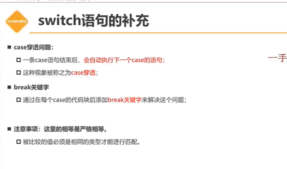

# 1.定义变量的时候我们最好是要先对他初始化


# String字符串

* 单引号
* 双引号
* **反引号 `${}`   {}里面可以添加我们的变量  运算都可以  Es6新增的**
* 转义字符  String()   toString
* 字符串补充  
  * +加号实现字符串隐式转换  连接
  * 长度   .length   包装类型具有属性


# object类型  

* 也是被称为引用类型或者是复杂类型
* 相当于是一个对象 【是一个包含数据集合的一个东西】

# null类型

### null表示对象为空  //object类型

**null 转换为我们的Boolean值的时候会转换为false   Null存在的意义就是对我们的对象初始化，因为对象初始化的时候，如果只是加上一个 {} 大括号对其初始化话，还是会在对内存中申请了一个对象  然后再if 判断语句中的会默默的转换为 布尔值 True的   如果初始化为 null时，就会存在我们的虚拟地址0x0中  真正的初始化**

其他类型【number 、String】 初始化为       **0 、“ ”、false的时候  其实在if中就转变为false**

  **null与undefined的区别**


#  数据类型总结


# 数据类型转换

## 字符串类型转换

**typeof 是一个操作符  可以判断数据类型  后面如果加上的是括号  后面的一部分被视为一个整体   而不是一个函数调用**

* 字符串隐式转换  加号

* 显示转换   使用函数 String（） **string 为一个函数  所以调用的时候我们要加上括号**

## 数据类型转换

* **非加号操作  然后进行数字的操作运算  那么就会进行隐式运算**  
* **Number（其他的数据类型） undefined转换是会转换为 NaN** [非数字类型转换数字类型会变为 NaN]   **空字符串会转换为0**
* 

# Boolean布尔值转换

* 隐式转换 ： 分支语句【条件判断语句、循环语句等等这种】
* 显示转换 ： 使用关键字 【Boolean】
*  与 === 符号  == 在我们两个数据类型不一致的时候 先把我们的数据转换为number 才去比较**

* **在 == 号 的时候 只有null被视为一个对象类型 和我们的原始类型进行比较**

# 程序的执行顺序


# 代码块的理解

**为了完成某一个特定的功能的时候，我们将这些代码放入到一个代码块中**


# 分支结构的理解


# if语句的补充


# 三元表达式

**给变量赋予一个默认值**

 **三元表达式中的第一个  info 会发生隐式转换  为true  or false**

```
 var obj = info ? info : {};  //而且三元运算符会返回一个值的  因为这算是一个行数
```


# 逻辑或的本质


###                本质推导一：多条件是如何进行判断的

   1. **先将运算元转成 Boolean 类型**

   2. **对转成的Boolean进行判断 .**

                  1. **如果是为true, 直接将结果(原类型返回)**
                  2. **如果是为false，进行第二个运算元的判断** 

      ###            本质推导二：获取第一个值的结果
    
      1. 当我们的一个函数需要传递参数的时候不确定这个参数是否需要传参 
    
      ​                                  
    
      赋值给别人的时候【**在我们不确定是否是有实际值的时候**】我们通常在其的变量名后加上 || “我是默认值”


​      

         # 逻辑与的本质

1. 也是可以脱离我们的条件判断来使用
2. 将运算元转换成我们的Boolean值
   * 如果false,返回运算元（原始值）
   * 如果为true，查找下一个继续运算
   * 以此类推
3. 如果查找了所有的运算元都为true,那么返回最后一个运算元（原始值）


**为了使代码更加的安全【不知道我们对象里面是否有我们调用的属性和方法】 所以我们选择了 与逻辑 让我们的代码更加的安全**

# Switch语句



# break语句

使用break命令，退出的是**离它最近的一层循环**，所以你的程序中调用break退出的是内层的for循环


